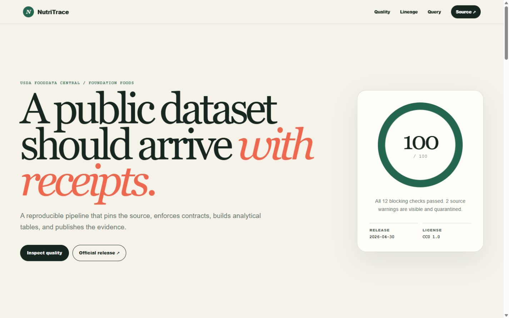
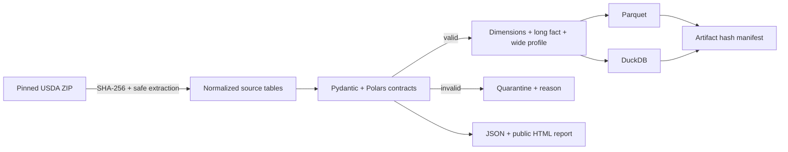

# NutriTrace — reproducible food data pipeline

[](https://github.com/jord-andrade/food-data-pipeline/actions/workflows/ci.yml)
[](https://nutritrace-data.vercel.app)
[](https://fdc.nal.usda.gov/download-datasets/)
[](./DATA_LICENSE.md)
[](./LICENSE)

NutriTrace is a one-command data engineering case study over USDA FoodData Central Foundation Foods. It downloads a pinned source, verifies its SHA-256 digest, validates relational and domain contracts, quarantines invalid observations, and produces compressed Parquet, an indexed DuckDB database, an artifact manifest, and a public quality report.

**[Open the live quality report](https://nutritrace-data.vercel.app)** · [Source provenance](./docs/source-provenance.md) · [Architecture](./docs/architecture.md) · [Data dictionary](./docs/data-dictionary.md)



## Why this exists

Public data is not automatically analysis-ready. A trustworthy pipeline should make five things inspectable:

- where the bytes came from and which release they represent;
- whether the downloaded archive is exactly the one expected;
- which schema, key, unit, null, and range rules were applied;
- what happened to records that failed a rule;
- how a reviewer can reproduce the same analytical layer from a clean clone.

NutriTrace makes each of those claims executable.

## Reproduce the committed sample

Prerequisites: Python 3.12 and [uv](https://docs.astral.sh/uv/).

```bash
git clone https://github.com/jord-andrade/food-data-pipeline.git
cd food-data-pipeline
uv sync --frozen
uv run food-pipeline run
```

That command reads the committed 20-food sample and writes:

| Artifact | Purpose |
|---|---|
| `build/parquet/dim_food.parquet` | food identity, category, and publication date |
| `build/parquet/dim_nutrient.parquet` | referenced nutrient definitions and units |
| `build/parquet/fact_food_nutrient.parquet` | 1,851 validated long-form observations |
| `build/parquet/food_nutrition_wide.parquet` | analysis-ready core nutrient profile |
| `build/parquet/quarantine_food_nutrient.parquet` | rejected rows with an explicit reason |
| `build/food_data.duckdb` | indexed local analytical database containing every layer |
| `build/quality-report.json` | machine-readable contract results |
| `build/manifest.json` | SHA-256 digest for every analytical artifact |
| `site/` | deterministic, deployable evidence report |

The build directory is intentionally ignored. The sample and public report are versioned; heavyweight raw and derived data are not.

## Run the pinned full release

```bash
uv run food-pipeline download
uv run food-pipeline run \
  --source data/raw/FoodData_Central_foundation_food_csv_2026-04-30 \
  --output build/full \
  --site build/full-site
```

The downloader accepts only the pinned April 2026 Foundation Foods archive and verifies this digest before extraction:

```text
d6d4f41dcd19a46abcdd67775379cb6f0292ff08daa7e0680fdd0982830bf57b
```

Archive members are resolved before extraction to reject path traversal. The full release remains outside Git by design.

The complete April 2026 archive was also exercised locally through the same code path: 395 Foundation Foods, 17,008 source observations, 16,965 accepted fact rows, and 43 quarantined rows. All 12 blocking contracts passed; the report disclosed 1 missing nutrient reference, 33 missing amounts, and 10 negative analytical amounts as source warnings.

## Honest quality evidence

The committed sample contains 20 Foundation Foods and 1,852 source observations. All 12 blocking contracts pass. The source also contains one USDA row (`food_nutrient.id = 33291134`) with both a missing amount and a nutrient identifier (`2066`) absent from the downloaded nutrient dimension.

NutriTrace does not hide or silently repair it:

1. both source anomalies appear as warnings in the report;
2. the single affected row is written to the quarantine layer;
3. 1,851 valid rows continue into the analytical fact;
4. no missing nutrient value is imputed.

This distinction is deliberate: a source-quality warning remains visible, while a violation introduced by pipeline logic is blocking.

## Architecture



The data path is split into pure, testable boundaries: source loading, contracts, quality reporting, transformation, storage, and presentation. See [`docs/architecture.md`](./docs/architecture.md) for the failure model and design trade-offs.

## Quality gates

```bash
uv run pytest
uv run ruff check .
uv run ruff format --check .
uv run mypy src tests
uv run pip-audit -r requirements.txt
uv run food-pipeline run
git diff --exit-code -- site
```

The last two commands prove that the public report is generated from the committed sample and has no undocumented drift.

## Source and licensing

- Data: [USDA FoodData Central Foundation Foods, April 2026 CSV](https://fdc.nal.usda.gov/download-datasets/).
- Data terms: USDA states FoodData Central data are public domain and published under CC0 1.0 in its [official API guide](https://fdc.nal.usda.gov/api-guide/).
- Suggested source credit: U.S. Department of Agriculture, Agricultural Research Service, FoodData Central.
- Pipeline code: [MIT](./LICENSE).

The committed sample preserves the original FDC identifiers and carries machine-readable provenance in [`data/sample/SOURCE.json`](./data/sample/SOURCE.json). See [`DATA_LICENSE.md`](./DATA_LICENSE.md) for the separation between code and data terms.

## Limitations

- The sample proves the pipeline path; it is not representative of the complete food supply.
- Core nutrient columns use USDA per-100 g values and remain null when the source has no observation.
- The archive checksum intentionally makes upstream replacements fail closed. A new USDA release requires a reviewed source-version change.
- The static report is evidence for the committed sample, not a nutrition recommendation tool.

## Repository map

```text
data/sample/              20-food CC0 sample + machine-readable provenance
src/food_pipeline/        downloader, contracts, validation, transforms, report
tests/                    contract, security, quality, determinism, and E2E tests
docs/                     architecture, provenance, quality rules, data dictionary
sql/                      demonstrative analytical query
site/                     generated public quality evidence
.github/workflows/        clean-environment reproducibility gates
```
